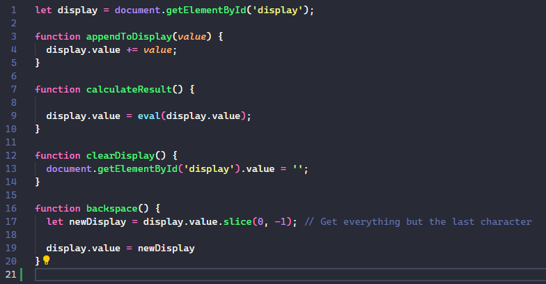
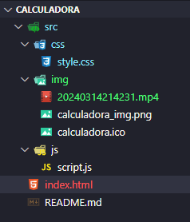
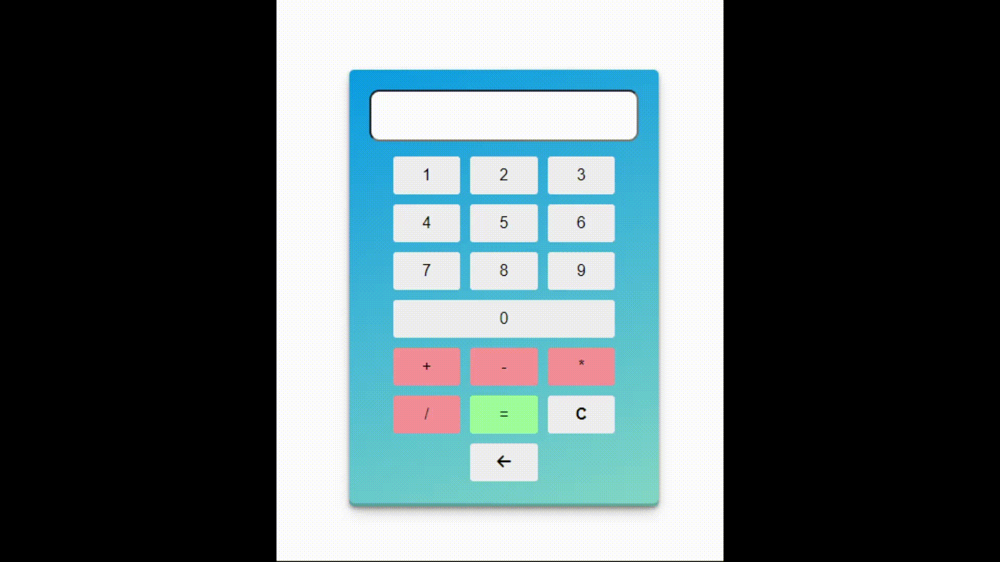

#  PROJETO CALCULADORA

Aqui você vai encontrar um pequeno projeto em HTML, CSS e JavaScript. Esse projeto mostra uma **calculadora básica** .
A calculadora é feita toda no HTML e CSS puro.

 
   
  

## DESCRIÇÃO DO PROJETO :computer:

Uso o JavaScript com a função eval() para fazer os cálculos.

 

 
  
 

### GIF DO PROJETO

 

 

 
 

:smile: **<a href="https://cellerligia-23.github.io/calculadora/">Página do projeto Calculadora Básica</a>** :blush:
